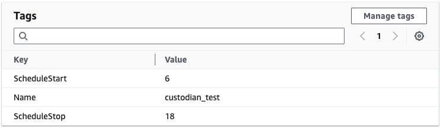
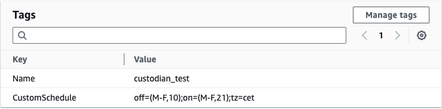

# Resource Scheduler

Resource scheduler is based on Cloud Custodian ([link](https://cloudcustodian.io/)). Policies created are evaluated 
every hour. All policies executed by single lambda function.
Scheduler has basic start-stop functionality on EC2 instances.
Resource schedules can be set via tags. There are predefined start,stop and custom schedule tag. 

| Tag Name       | Enabled Value          | Explanation                                     |
|----------------|------------------------|-------------------------------------------------|
| StartSchedule  | 6,7,8                  | Starts stopped EC2 instance at given hour       |
| StopSchedule   | 17,18,19               | Stops running EC2 instance at given hour        |
| CustomSchedule | Schedule Parser Format | Starts or stops instance by given parser format |

### Sample Tags Defined for an EC2 instance
Instance starts at 6 CET and stops at 18CET


Instance Starts at 21CET and stops at 10CET on weekdays



### Schedule Parser Syntax
With custom schedule parser schedule can set manually besides predifined values.
Each definition always be like ```(days,hours)```. Multiple spesifications are like ```[(days,hours),(days,hours),
(days,hours)]```. Each schedule definition must have tz value as in examples.

```
# up mon-fri from 7am-7pm; central europian time
off=(M-F,19);on=(M-F,7);tz=cet
# up mon-fri from 6am-9pm; up sun from 10am-6pm; central european time
off=[(M-F,21),(U,18)];on=[(M-F,6),(U,10)];tz=cet
```

| field | values              |
|-------|---------------------|
| days  | M, T, W, H, F, S, U |
| hours | 0-23                |

Days can be defined as range like M-S.
